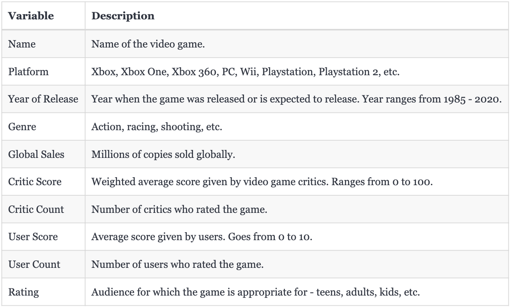
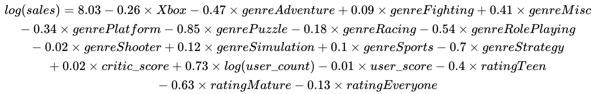
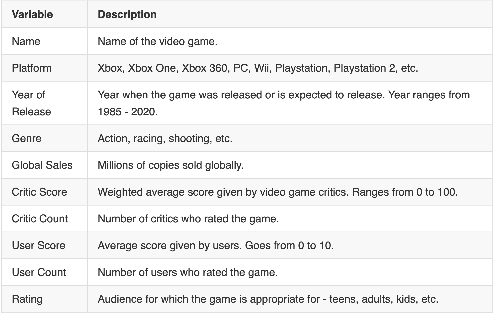
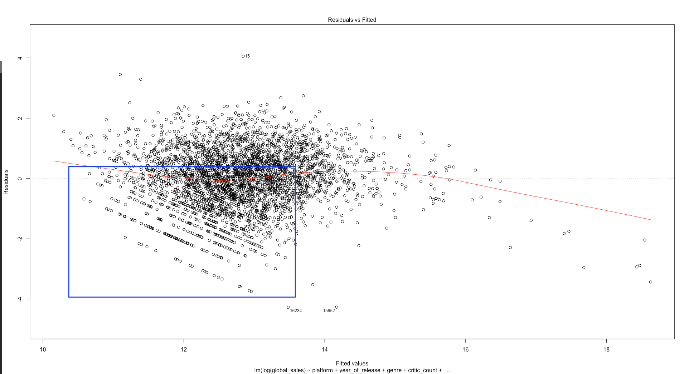

```{r setup, include=FALSE}
knitr::opts_chunk$set(echo = TRUE)
```

```{r include=FALSE, echo=FALSE, message=FALSE, warning=FALSE}

rm(list=ls())
setwd("/Users/amandeeprathee/Desktop/ids-702-project/")


# load libraries
library(kableExtra)
library(tidyverse)
library(mice)
library(corrplot)
library(car)
library(MASS)

library(gridExtra)
options(scipen=10000)


# read data
sales <- read.csv("video-game-sales.csv", na.strings = c("", "N/A", "tbd", NA),
                  colClasses = c("character", "factor", "integer", "factor", 
                                 "character", "numeric", "numeric", "numeric", 
                                 "numeric", "numeric", "integer", "integer",
                                 "numeric", "integer", "character", "factor"))


# change variable names to lower case
names(sales) <- tolower(names(sales))

# discard all sales variables except global sales
sales$na_sales <- NULL
sales$eu_sales <- NULL
sales$jp_sales <- NULL
sales$other_sales <- NULL

# also discard publisher and developer - both of these have around 1000 categories
sales$developer <- NULL
sales$publisher <- NULL

# 60% rows have missing data, therefore, drop rows with missing value(s)
sales <- na.omit(sales)

# change scale of global_sales from number of units in million to number of units sold
sales$global_sales <- sales$global_sales * 1e6


# change buckets of rating
sales <- sales[!sales$rating %in% c("AO", "K-A", "RP"), ]
sales$rating <- as.character(sales$rating)
sales$rating[sales$rating == "E"] <- "Everyone"
sales$rating[sales$rating == "E10+"] <- "10+"
sales$rating[sales$rating == "M"] <- "17+"
sales$rating[sales$rating == "T"] <- "13+"
sales$rating <- factor(sales$rating)


# bucket all playstations in one category, all xbox in one category and discard all others
consoles <- levels(sales$platform)[levels(sales$platform) %in% c("PS", "PS2", "PS3", 
                                                                 "PS4", "X360", "XB", "XOne")]
sales <- sales[sales$platform %in% consoles, ]
sales$platform <- factor(sales$platform)
sales$platform <- as.character(sales$platform)
sales$platform[sales$platform == "PS"] <- "Playstation"
sales$platform[sales$platform == "PS2"] <- "Playstation"
sales$platform[sales$platform == "PS3"] <- "Playstation"
sales$platform[sales$platform == "PS4"] <- "Playstation"
sales$platform[sales$platform == "PSP"] <- "Playstation"
sales$platform[sales$platform == "PSV"] <- "Playstation"
sales$platform[sales$platform == "X360"] <- "Xbox"
sales$platform[sales$platform == "XB"] <- "Xbox"
sales$platform[sales$platform == "XOne"] <- "Xbox"
sales$platform <- factor(sales$platform)


# consider games only after 2002 -- when both consoles were available in the market for the first time simultaneously
sales <- sales[sales$year_of_release >= 2002, ]


# new response: mean sales per year
sales$game_age <- 2017 - sales$year_of_release
sales$sales <- sales$global_sales/sales$game_age


```


# 1. Summary

Xbox and Playstation are two major gaming consoles today. The primary aim of this analysis was to find out which games sell more: the ones made for Xbox or the ones made for Playstation? I used a multiple linear regression model to answer this question and found out that the Xbox version of a game sells 23% less as compared to the Playstation version.


# 2. Introduction

Playing video games on consoles have gained popularity exponentially over the last few decades. Some people play them for recreation while some make a living playing them. It’s a multi-billion dollar market with hundreds of titles released each year. Every game publisher wants their game to become the next sensation in the market. When a video game company develops a new game, they need to decide the platform (aka console) that they are going to create their game for. The two biggest consoles in the market today are Sony's Playstation and Microsoft's Xbox. Software engineering for both these consoles differs, which means production cost of a game that is released for both consoles is higher than the cost of a game that is released for a single console. Except for big players, not all companies can afford such expenses, especially the developers who are new in the business. Hence, a natural question arises - "Which console should game developers target and make their game for?". This is the **primary question** that I'll address in this report.

The **secondary goal** of this project is to find out which video game genres affect sales positively and which ones impact it negatively. Just like movies or books, certain genres enjoy more popularity than others.


# 3. Data


### 3.1 Dataset

The data that I used is hosted [here](https://www.kaggle.com/rush4ratio/video-game-sales-with-ratings) on Kaggle and it was scraped from [Metacritic](https://www.metacritic.com/game). The original dataset had 16719 observations and 16 variables (see Appendix, section 1). Six variables were not appropriate for this analysis. These were removed right away leaving 10 variables as shown in figure 1.

{ height=30% }


In the table shown above, global sales are used to create the response variable. Global sales contain the number of units of video games sold (in millions) from its launch date until December 2016 (which is the date when the data was collected). There were four other variables with sales figures in particular parts of the world - North America, Europe, Japan and all other countries. These variables could not be used in the analysis because global sales are the sum of all these sales, and therefore, these were removed to get rid of redundant information. The other two variables that were removed are *Publisher* and *Developer*. Both these are categorical variables with around two thousand categories each. So many groups would have posed a problem while modeling so I removed these.


### 3.2 Data Preprocessing

Now, several **preprocessing** steps were taken before starting modeling process. All these steps are listed below:

* **Missing values**: About 60% of the rows had one or more missing values. About 40% rows have *critic_count, critic_score, user_count, user_score* and *rating* missing at the same time. Another major factor os this missing data is the fact that the data was collected in December 2016 but includes data about future games until 2020. There are no sales figures for these games because they are still under production. It did not make sense to impute so many observations so I decided to use only complete cases - 6826 observations in total. And the data now ranges from 1985 till 2016.

* **Rating**: The rating variable is similar to movie censorship rating and tells us which audience is the game suitable for. There were two categories that had 3 observations in total. It didn't make sense to include because of the lack of information in each category. Therefore, I removed these two categories which resulted in removing three observations. These categories were *Adults Only* and *Rating Pending*.

* **Platform**: Initially, there were 17 gaming platforms including large consoles, PC as well as handheld gaming devices. I discarded all rows pertaining to platforms other than Playstation and Xbox consoles. Further, I labeled all the different Playstation devices as "Playstation" and all different Xbox devices as "Xbox" because my research question focuses on looking at the difference in sales between Xbox and Playstation, not between Playstation 1, Playstation 2, Playstation 3, Xbox, Xbox 360 and Xbox One.

* **A fair chance for Xbox**: Playstation was released in 1994. However, the first Xbox was released from November 2001 till  March 2002 around the world. To be fair to Xbox, I considered only those games that were released in the presence of both the consoles. Therefore I only kept games that were released in and after 2002. 3531 observations were left after this step.

* **User score**: I multiplied user_score with ten to change its scale from 0-10 to 0-100. This was done to compare the effect of user_score with critic_score, which ranges from 0-100.


### 3.3 Creating response variable

Initially, *global_sales* was the response variable for this analysis. However, after looking at its distribution (see Appendix, section 2), and analysing the residuals plots after preliminary linear regression modeling, I realised that despite being continuous, this variable was not an ideal response variable for linear regression. All the residual plots had some discernible pattern. The problem was caused because *global_sales* variable was an accumulation of all the sales from the time of release of the game until December 2016. Therefore, the longer the game was in the market, the higher its sales. To get rid of this inherent time element, I created average *sales* per year for each game, and used this as the response variable for further analysis. The exact formula is given in Appendix, section 3.


### 3.4 Exploratory Data Analysis

I did thorough analysis of the data. I looked at the nature of the relationship between the response and the predictors through univariate, bivariate and multivariate analysis. First, I looked at the response variable (plot 1), which was highly skewed to the left as expected with any sales. I used a log transformation (plot 2) which does a good job at normalizing the response.

-------------------


```{r include=FALSE, echo=FALSE, message=FALSE, warning=FALSE}
p1 <- sales %>%
  ggplot(aes(x=sales/1e6)) +
  geom_histogram(fill="orange") +
  labs(title="Plot 1: Distribution of Mean Sales Per Year", x="Sales (in million units)", y="Number of Video Games") +
  theme_minimal() +
  theme(plot.title = element_text(size=10))

p2 <- sales %>%
  ggplot(aes(x=log(sales))) +
  geom_histogram(fill="orange") +
  labs(title="Plot 2: Log Transformation of Sales", x="LOG(Sales)", y="Number of Video Games") +
  theme_minimal() +
  theme(plot.title = element_text(size=10))

p3 <- sales %>%
  ggplot(aes(x=platform, y=log(sales))) +
  geom_boxplot() +
  labs(title = "Plot 3: Consoles and Sales", x="Console", y="LOG(Sales)") +
  theme_minimal() +
  theme(plot.title = element_text(size=10))

```

```{r include=TRUE, echo=FALSE, message=FALSE, warning=FALSE, fig.width=10, fig.height=3}

grid.arrange(p1, p2, p3, ncol=3)

```

---------------------------------------


Now, the most important predictor is *platform* which what will answer my research question. Looking at plot 3 above, it seems that Playstation games witness more sales as compared to Xbox games. But we can't make any conclusions at this point.


Next, I visualized the variables critic_score, critic_count, user_score and user_count (see Appendix, section 4). The most interesting of these was *user_count*. The distribution of user count was similar to *sales* - highly skewed. Therefore I tried log transforming it as well. The following figure shows the relationship between log of *sales* and *user_count* on the left (looks non-linear) and log of *sales* and log of *user_count* on thr right (looks linear). Therefore, I will try *log(user_count)* as a predictor instead of *user_count*.


Finally, I also used multivariate analysis and tried plotting several variables at the same time to explore interactions. There didn't seem to be much interaction between the variables except one. There appears to be an interaction (see Appendix, section 5) between *log(user_count)* and *rating*. As a result, I tried this interaction in the modeling section.


# 4. Model

```{r include=FALSE, echo=FALSE, message=FALSE, warning=FALSE}

linear.model <- lm(log(sales) ~ platform + genre + critic_score + log(user_count) + user_score + rating, data = sales)

```

The response variable is a non-negative continuous variable. Therefore my choice of models was restricted to a linear regression model or one of the count regressions such as Poisson or negative binomial. After trying all of these regressions, the final model that I have used to answer the research questions is shown in figure 2.

{ height=9% }


### 4.1 Model Selection

Recall that my primary goal was to see whether video game sales differ for Playstation and Xbox while the secondary aim was to see which genres have a positive impact on sales and which ones have a negative effect Therefore, I included these two variables - *platform* and *genre* - in every model that I built. During exploratory analysis, I had observed that a log transformation on *user_count* works better and I confirmed it while creating linear regression model (see Appendix, section 6).

For **feature selection**, I used forward and backward stepwise selection with ACI as the selection criterion to come up with a good starting model. This model had some interaction that looked important during EDA. However, I ended up removing all the interaction terms one by one based on their high VIF value. 

Because sales is a non-negative continuous outcome, I also **tried various other count regression models** such as Poisson regression, quasipoisson regression and negative binomial regression. Poisson regression didn't work well because the variance of the response variable was much higher than the mean. The residual plot had the problem of heteroskedasticity. Therefore I tried quasipoisson and negative binomial regression. I found that the quasipoisson suffered from the same problem as the Poisson model. However, the negative binomial model worked well with no issues found while diagnosing the model. But I decided to go ahead with the linear regression model as it was easier to interpret and answer the questions of interest.


### 4.2 Model Validation

To validate the linear regression model, I used the residual plot and QQ plot along with other standard diagnostic plots (see Appendix, section 7). The residuals have no discernible pattern and look independent with constant variance which is the assumption of a linear regression model. All of them suggested that the model is fine with no serious issues to worry about. I also used the VIF to discard all the terms that had VIF value higher than 5. All VIF values in the final model are under 3.


### 4.3 Results

Because I regressed on log(sales), it makes sense to look at the exponentiated coefficients instead of raw coefficients. The following table shows the exponentiated coefficients of all the final terms in the model. 


{ height=30% }

* **First**, I'll answer the question of which is platform witnesses a higher number of video game sales. Playstation is absorbed in the intercept while the coefficient of Xbox is 0.77 which means that if a developer chooses to release their game for Xbox, **the number of games sold for Xbox is 23% lower than the number of games sold for Playstation**.

* The **second goal** was to find relationship between *genre* and *sales*. As we can see, not all genres are statistically significant. Only miscellaneous games have positive effect on sales as compared to action genre which is included in the intercept. If the game belongs to the miscellaneous genre, it sells 52% more than an action game. All other genres have a negative effect on sales. Adventure, platform, puzzle, racing, role-playing and strategy games all sell lower by 37%, 29%, 58%, 17%, 42% and 51%, respectively, as compared to an action title.

* Interestingly, *user_score* has a negative effect on sales while *critic_score* has a positive impact. With one unit increase in critic score (ranges from 0-100), the sales go up by 2%. While with a 0.1 unit increase in user score (ranges from 0-10), the sales fall by 1%.

* The exponentiated coefficient of *log(user_count)* is 2.09. In other words, the sales are exponentiated by a factor of $n^2$ where n is the number of users rating the game.

* On the rating front, the most popular games are games that are rated 10+. All the other categories reeive lower sales. 17+ games witness lower sales than 13+ games.


# 5. Conclusion

In conclusion, if a game developer has the resources to make a game for only one platform, they should make it for Playstation because games made for this platform sell more than games made for Xbox. Further, the highest selling genres are miscellaneous games and action games. On the other hand, puzzle and strategy games have the lowest sales figure as compared to other categories. It would help video game developers to keep these facts in mind while developing their next game.


### 5.1 Limitations

There are a few limitations to my model. **First**, the sales data that is collected was cumulative. It would make more sense to have an **year by year sales data** for each video game instead of cumulative sales till date. I tried to make the sales year by year but it's not a precise calculation. For example, a game released in January 2016 and a game released in October 2016 both have the denominator (which represents the age of the game) as one. **Second**, the sales variable is **highly skewed**. Even after log transformation, the variable does not look like an ideal normal distribution. The QQ plot (see Appendix) also confirms thisa although this is not too much of a worry because the residuals still looked normal.


\pagebreak

# Appendix

### Section 1: Description of original dataset

16719 observations and 16 variables.

Variable                   |                                 Description 
-------------------------- | --------------------------------------------------------------------------------
Name                       |  Name of the video game.
Platform                   |  Xbox, Xbox One, Xbox 360, PC, Wii, Playstation, Playstation 2, etc.
Year of Release            |  Year when game was released. Data is from 1985 - 2020.
Genre                      |  Action, racing, shooting, etc.
Publisher                  |  Company that published the video game.
NA Sales                   |  Millions of copies sold in North America.
EU Sales                   |  Millions of copies sold in Europe.
JP Sales                   |  Millions of copies sold in Japan.
Other Sales                |  Millions of copies sold in all other countries.
Global Sales               |  Millions of copies sold globally.
Critic Score               |  Weighted average score given by video game critics. Ranges from 0 to 100.
Critic Count               |  Number of critics who rated the game.
User Score                 |  Average score given by users. Goes from 0 to 10.
User Count                 |  Number of users who rated the game.
Developer                  |  Company which developed the game.
Rating                     |  Audience for which the game is appropriate for - teens, adults, kids, etc.


### Section 2: Problem with *global sales*


```{r include=TRUE, echo=FALSE, message=FALSE, warning=FALSE, fig.width=6, fig.height=3}

sales %>%
  ggplot(aes(x=global_sales/1e6)) +
  geom_histogram(fill="orange") +
  labs(title="Distribution of Global Sales", x="Global Sales (in million units)", y="Number of Video Games") +
  theme_minimal()

```




### Section 3: Creating average sales per year

$$sales = \frac{global\_sales}{2017-year\_of_\_release}$$

I divided each sales figure by the number of years a game had been in the market. Because the data was collected in December 2016, I subtracted release year from 2017 so that the minimum years that a game is in the market is equal to 1 and thus it avoids dividing by zero problem. This response variable is the average number of video game copies sold per year for a particular game.


### Section 4

##### Log transforming *user_count*


```{r include=FALSE, echo=FALSE, message=FALSE, warning=FALSE}

p1 <- sales %>%
  ggplot(aes(x=user_count, y=(log(sales)))) +
  geom_point(color="red") +
  geom_smooth(method = "auto") +
  labs(x="User Count", y="LOG(Sales)", title = "User Counts and LOG(Sales) - Non-linear Relationship") +
  theme_minimal()

p2 <- sales %>%
  ggplot(aes(x=log(user_count), y=(log(sales)))) +
  geom_point(color="red") +
  geom_smooth(method = "auto") +
  labs(x="LOG(User Count)", y="LOG(Sales)", title = "LOG(User Counts) and LOG(Sales) - Linear Relationship") +
  theme_minimal()


```

```{r include=TRUE, echo=FALSE, message=FALSE, warning=FALSE, fig.width=10, fig.height=3}

grid.arrange(p1,p2, ncol=2)

```

##### Other plots

```{r include=FALSE, echo=FALSE, message=FALSE, warning=FALSE}

p1 <- sales %>%
  ggplot(aes(x=critic_score, y=(log(sales)))) +
  geom_jitter() +
  geom_smooth(method = "auto") + 
  labs(title = "Critic Score and Sales", x="Critic Score", y="LOG(Sales)") +
  theme_minimal()


p2 <- sales %>%
  ggplot(aes(x=critic_count, y=(log(sales)))) +
  geom_jitter() +
  geom_smooth(method = "auto") + 
  labs(title = "Critic Count and Sales", x="Critic Count", y="LOG(Sales)") +
  theme_minimal()

p3 <- sales %>%
  ggplot(aes(x=log(user_count), y=(log(sales)))) +
  geom_jitter() +
  geom_smooth(method = "auto") + 
  labs(title = "User Count and Sales", x="LOG(User Count)", y="LOG(Sales)") +
  theme_minimal()


p4 <- sales %>%
  ggplot(aes(x=user_score, y=(log(sales)))) +
  geom_jitter() +
  geom_smooth(method = "auto") + 
  labs(title = "User Score and Sales", x="User Score", y="LOG(Sales)") +
  theme_minimal()

p5 <- grid.arrange(p1, p2, ncol=2)
p6 <- grid.arrange(p3, p4, ncol=2)


# genre and sales
p7 <- sales %>%
  ggplot(aes(x=genre, y=log(global_sales))) +
  geom_boxplot() + 
  labs(title = "Game Genre and Sales", x="Genre", y="LOG(Sales)") +
  theme_minimal()
  

# rating and sales
p8 <- sales %>%
  ggplot(aes(x=rating, y=log(global_sales))) +
  geom_boxplot()+ 
  labs(title = "Rating and Sales", x="Rating", y="LOG(Sales)") +
  theme_minimal()


```

```{r include=TRUE, echo=FALSE, message=FALSE, warning=FALSE, fig.width=10, fig.height=8}

grid.arrange(p5, p6, nrow=2)

```

```{r include=TRUE, echo=FALSE, message=FALSE, warning=FALSE, fig.width=10, fig.height=4}

grid.arrange(p7, p8, ncol=2)

```


### Section 5


```{r include=TRUE, echo=FALSE, message=FALSE, warning=FALSE, fig.width=6, fig.height=3}

sales %>%
  ggplot(aes(x=log(user_count), y=log(sales), color=rating)) +
  geom_jitter(alpha=0.3) +
  geom_smooth(method = "auto") +
  theme_minimal() +
  labs(title = "User Count and Rating", x="LOG(User Count)", y="LOG(Sales)")

```


### Section 6

I regressed log(sales) on both - user_count and log(user_count) separately. I found that log(user_count) gave much better results looking at the r-squared and residuals plots of both the models.


### Section 7

```{r include=FALSE, echo=FALSE, message=FALSE, warning=FALSE}

p1 <- sales %>% 
  ggplot(aes(x=fitted(linear.model), y=residuals(linear.model))) + 
  geom_point(alpha=0.5) +
  labs(title="Residual Plot", x="Fitted Log(Sales)", y="Residuals") +
  theme_minimal()

p2 <- sales %>%
  ggplot(aes(sample = log(sales))) + stat_qq(alpha=0.5) + 
  stat_qq_line() + 
  theme_minimal() + 
  labs(title="QQ-Plot")


```

```{r include=TRUE, echo=FALSE, message=FALSE, warning=FALSE, fig.width=6, fig.height=3}

grid.arrange(p1, p2, ncol=2)

```


```{r include=TRUE, echo=FALSE, message=FALSE, warning=FALSE, fig.width=6, fig.height=3}


sales %>% 
  ggplot(aes(x=critic_score, y=residuals(linear.model))) + 
  geom_jitter(alpha=0.5) +
  labs(title="Residual Plot", x="Critic Score", y="Residuals") +
  theme_minimal() 

```


```{r include=TRUE, echo=TRUE, message=FALSE, warning=FALSE}

kable(vif(linear.model))

```


```{r include=FALSE, echo=FALSE, message=FALSE, warning=FALSE}


```


